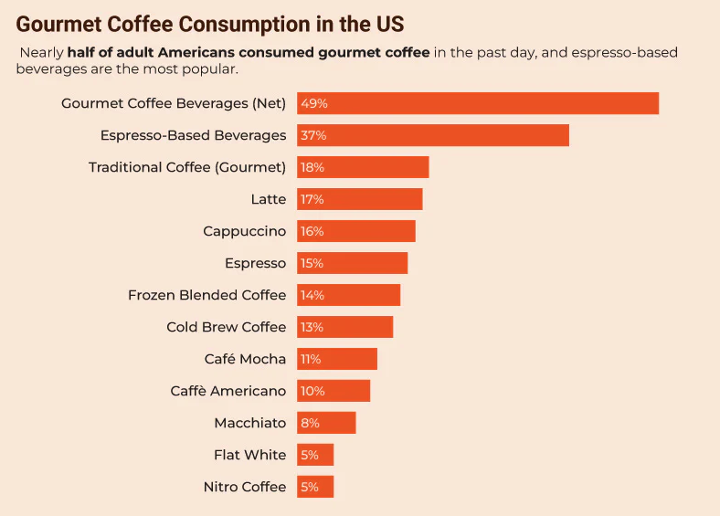

# TITLE : Mobile order app for local coffee shops
Carter Kim, Fall 25

## Introduction
In the fast-paced society we live in, people do not want to waste time on anything. The desire to seek optimization in every aspect of life is prevalent. Take grocery shopping, for example. Twenty years ago, nobody thought of having their groceries delivered to their doorstep with just a couple of scrolls and clicks. The integration of technology into the services we use daily has significantly made our lives better. However, I have noticed that the coffee industry, unlike other daily services, has not built an efficient way of delivering its service to people. Part of the reason could be its culture; people often don't want to rush the experience, preferring to savor every bit of it. However, this doesn’t account for coffee drinkers in a mega-city. People rush in and out, looking for a drink to wake their sleep-deprived bodies up and kick off the day. Big coffee franchises like Starbucks or Dunkin’ offer "Siren Order" (mobile ordering) where you can pick up your drink at your desired time to avoid waiting. But those big franchises offer limited options. You usually can’t select specific beans or drip styles. Local coffee shops offer these options, but they lack the technology to provide mobile ordering. As a result, if you want to drink good coffee but have no time to wait, you are forced to settle for a big franchise’s unified, over-roasted coffee due to this technological gap. 

The purpose of my local coffee shop mobile ordering app is to solve this problem. It builds a bridge between busy coffee lovers and local coffee shops that lack this technology.

## Motivation
I chose this topic because I am a huge coffee enthusiast. As described earlier, big franchises like Starbucks offer great convenience to their customers through the Siren order (mobile ordering) functionality on their apps. People can order and even customize their drinks and simply show up to pick them up. This ensures people don't waste time waiting in line or waiting for backed-up orders at the counter. However, big franchises have prioritized consistency over quality. A prime example of this business strategy is over-roasting their beans. Major coffee chains over-roast their beans to unify the flavor profile, ensuring the same experience for clients all over the world. While the pro of over-roasting is consistency, the con is a foul, bitter taste. Moreover, they rely on automated machines to brew coffee; while powerful enough to produce many cups in a short span, these machines can ruin the nuanced taste of the coffee. On the other hand, local coffee shops prioritize taste over uniformity. Because they don't have thousands of stores to manage, they can focus on quality. Local shops enhance the flavor through methods like letting customers choose their specific beans, using adequate roast levels, or offering hand-drip styles. Yet, despite serving the best-tasting coffee, local shops lack the technology to offer the Siren order convenience that big franchises do. Furthermore, since most are small, independent businesses, there is no central system or app to tie them together. When I have free time, I don’t mind waiting for my coffee; I enjoy the vibe and the smell of roasting beans. But during my internship in Seoul, waiting for my morning coffee was impossible. Running into large groups of office workers when I only had a few minutes to spare before running late to the office was the worst experience. I sometimes had to wait as long as 20 minutes. As a result, I stopped going to local shops and began sacrificing taste for the time-saving convenience of big franchises. Launching a Siren order app for local coffee shops will allow coffee lovers like me to enjoy high-quality coffee without worrying about being late to work or feeling rushed. Another primary motivation for this project is to support the small businesses around me. I am passionate about supporting the local economy. Through this mobile ordering functionality, local coffee shops can regain the customers they lost due to the technology gap. These are my primary motivations for undertaking this work.

Figure.1 Starbucks transaction volume

Figure.1 shows the transaction volume of Starbucks. They get 31% of their entire transactions through mobile order and the sheer volume has been growing over the years. 31% is huge and shouldn’t be neglected. The local coffee shops are currently missing this opportunity. 

## Project Statement
This project is about developing a centralized mobile ordering application designed specifically for local/independent coffee shops, bridging the technological gap between local cafes and global franchises. Currently, urban professionals are often forced to compromise between the superior taste of local coffee and the convenience of big chain order ahead systems, resulting in significant revenue loss for small businesses that cannot offer siren order technology. By implementing a platform that enables users to customize, order, and pay for premium coffee in advance, this project aims to empower local cafes to recapture the lost market transaction volume and to allow busy customers to enjoy high quality coffee without the wait while supporting the local small business economy.

## Target Audience
### Primary users
This application's target population consists primarily of busy urban professionals, students, and owners of local cafes who prioritize both quality and efficiency. In the fast-paced modern society, these individuals often face a dilemma I described in the personal motivation section: they desire the superior taste and unique vibe of local coffee shops but are forced to choose big franchises due to time constraints before work or classes. This platform will assist them in optimizing their morning routines by eliminating wait times, allowing them to integrate high quality coffee consumption into their tight schedules. Additionally, the audience includes digital natives who are accustomed to the convenience of mobile interfaces and cashless transactions. Unlike the typical customer of a large franchise who accepts standardized, over-roasted beans, these users are interested in the specific nuances of their drink such as bean origin, roast level, or drip style and require a technological solution that bridges the gap between their sophisticated taste preferences and their need for speed. Moreover, the demand for good tasting or high quality coffee is increasing.

Figure.2 coffee type consumption trends.
Figure.2 shows the people’s demand for high quality coffee.

